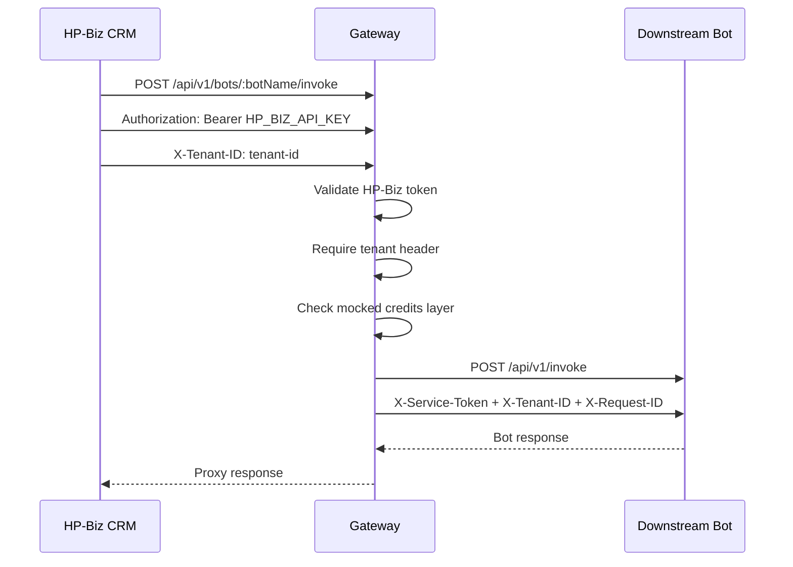
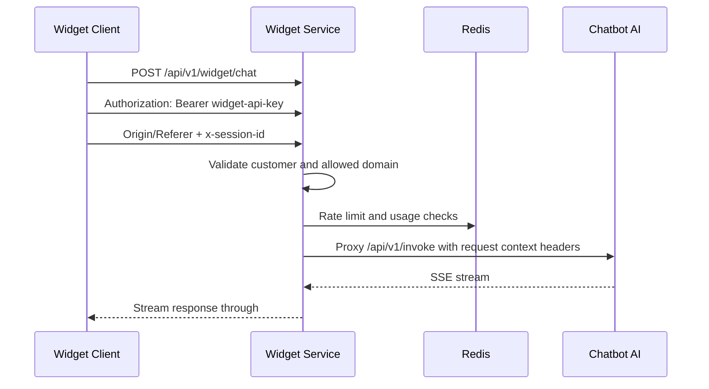

# HP-Intelligence Architecture

> Current architecture of the `hp-intelligence` monorepo as implemented in this repository.

---

## 1. Overview

HP-Intelligence is a pnpm monorepo for AI-facing Fastify services used in three traffic patterns:

- **Internal HP-Biz traffic** via `hp-intelligence-gateway`
- **Standalone direct bot traffic** to individual bot services
- **Widget traffic** via `hp-widget-service`, which currently proxies into `hp-chatbot-ai`

### Active services

- `@hp-intelligence/core`
- `@hp-intelligence/gateway`
- `@hp-intelligence/chatbot-ai`
- `@hp-intelligence/lead-categorizer-ai`
- `@hp-intelligence/widget-service`

### Current repo state

- `hp-chatbot-ai` is the most feature-complete bot. It supports streaming responses, session handling, persistence, prompt orchestration, semantic caching, and history lookup.
- `hp-lead-categorizer-ai` is currently a minimal scaffolded bot with placeholder invoke logic.
- `hp-widget-service` currently exposes widget chat and widget config endpoints only.
- `magic_link_tokens` migrations and `nodemailer` are present, but dashboard and magic-link HTTP routes are not implemented in the current codebase.
- The shared core package contains most cross-cutting infrastructure: logging, metrics, health checks, Redis, error handling, OpenAI client, auth helpers, and shared DB schema.

### Stack

- Node.js 24 in Docker images
- TypeScript
- Fastify 5
- pnpm workspaces
- PostgreSQL 15
- Redis 7
- Drizzle ORM for runtime access
- Knex for migrations
- OpenAI for model access
- Prometheus and Grafana for monitoring

---

## 2. High-Level Architecture

```mermaid
graph TB
    CRM[HP-Biz CRM] --> GW[hp-intelligence-gateway :4000]
    GW --> CHATBOT[hp-chatbot-ai :4001]
    GW --> CATEGORIZER[hp-lead-categorizer-ai :4002]

    SITE[Customer Website / Widget Client] --> WIDGET[hp-widget-service :4010]
    WIDGET --> CHATBOT

    EXT[External Client] --> CHATBOT
    EXT --> CATEGORIZER

    GW --> CORE[@hp-intelligence/core]
    WIDGET --> CORE
    CHATBOT --> CORE
    CATEGORIZER --> CORE

    CHATBOT --> PG[(PostgreSQL 15)]
    WIDGET --> PG

    CHATBOT --> REDIS[(Redis 7)]
    WIDGET --> REDIS
    GW --> REDIS
    CATEGORIZER --> REDIS

    PROM[Prometheus] --> GW
    PROM --> CHATBOT
    PROM --> CATEGORIZER
    PROM --> WIDGET
    GRAFANA[Grafana] --> PROM
```

### Request responsibilities

- `hp-intelligence-gateway` authenticates HP-Biz traffic, requires tenant context, applies mocked credit checks, and proxies to downstream bots from a static registry.
- `hp-widget-service` authenticates widget API keys, enforces domain rules, tracks usage in Redis, and streams chatbot responses back to clients.
- `hp-chatbot-ai` owns conversation state, prompt assembly, OpenAI streaming, caching, and history retrieval.
- `hp-lead-categorizer-ai` currently exposes a protected invoke endpoint and placeholder handler.

### Important implementation note

The repository contains both:

- **core multi-mode auth helpers** in `@hp-intelligence/core`
- **a service-local auth/session plugin** in `hp-chatbot-ai`

Today, `hp-lead-categorizer-ai` and newly scaffolded bots are aligned with `multiModeAuthPlugin`, while `hp-chatbot-ai` uses its own `chatbotAuthPlugin` because it also manages sessions, cookies, CSRF, and tenant-aware anonymous access.

---

## 3. Monorepo Structure

```text
hp-intelligence/
├── package.json
├── pnpm-workspace.yaml
├── tsconfig.base.json
├── Dockerfile
├── docker-compose.yml
├── docker-compose.prod.yml
├── docker-compose.monitoring.yml
├── ARCHITECTURE.md
│
├── packages/
│   └── hp-ai-core/
│       ├── package.json
│       ├── tsconfig.json
│       └── src/
│           ├── index.ts
│           ├── auth/
│           │   ├── gateway-auth.ts
│           │   ├── multi-mode-auth.ts
│           │   ├── standalone-auth.ts
│           │   └── widget-auth.ts
│           ├── cache/
│           │   └── semantic-cache.ts
│           ├── config/
│           │   └── base-config.ts
│           ├── db/
│           │   ├── base-connection.ts
│           │   └── shared-schema.ts
│           ├── errors/
│           │   ├── error-codes.ts
│           │   ├── error-messages.ts
│           │   └── registry.ts
│           ├── llm/
│           │   └── openai.ts
│           ├── logging/
│           │   └── logger.ts
│           ├── plugins/
│           │   ├── content-guard.ts
│           │   ├── error-handler.ts
│           │   ├── health.ts
│           │   ├── metrics.ts
│           │   ├── rate-limiter.ts
│           │   └── request-context.ts
│           ├── types/
│           │   ├── auth.ts
│           │   ├── conversation.ts
│           │   └── llm.ts
│           └── utils/
│               ├── api-error.ts
│               ├── api-response.ts
│               ├── circuit-breaker.ts
│               ├── encryption.ts
│               ├── http-status.ts
│               ├── llm-validator.ts
│               ├── redis-client.ts
│               ├── regex.ts
│               ├── secret-manager.ts
│               └── token-counter.ts
│
├── services/
│   ├── hp-intelligence-gateway/
│   │   ├── package.json
│   │   ├── tsconfig.json
│   │   ├── knexfile.ts
│   │   ├── Dockerfile
│   │   └── src/
│   │       ├── server.ts
│   │       ├── config.ts
│   │       ├── config/
│   │       │   └── bots.json
│   │       ├── controllers/
│   │       │   └── bot.controller.ts
│   │       ├── db/
│   │       │   └── migrations/
│   │       │       └── 20260327150000_create_tenants_table.ts
│   │       ├── plugins/
│   │       │   ├── auth.ts
│   │       │   ├── credits.ts
│   │       │   ├── registry.ts
│   │       │   └── tenant.ts
│   │       └── routes/
│   │           └── v1/
│   │               └── bot-router.ts
│   │
│   ├── hp-widget-service/
│   │   ├── package.json
│   │   ├── tsconfig.json
│   │   ├── knexfile.ts
│   │   ├── Dockerfile
│   │   └── src/
│   │       ├── server.ts
│   │       ├── config.ts
│   │       ├── controllers/
│   │       │   └── widget.controller.ts
│   │       ├── db/
│   │       │   ├── connection.ts
│   │       │   ├── schema.ts
│   │       │   └── migrations/
│   │       ├── jobs/
│   │       │   └── usage-sync.job.ts
│   │       ├── plugins/
│   │       │   ├── widget-security.ts
│   │       │   └── widget-usage.ts
│   │       ├── routes/
│   │       │   └── v1/
│   │       │       └── widget-api.ts
│   │       ├── types/
│   │       │   └── widget.ts
│   │       └── utils/
│   │           └── api-error.ts
│   │
│   ├── hp-chatbot-ai/
│   │   ├── package.json
│   │   ├── tsconfig.json
│   │   ├── knexfile.ts
│   │   ├── Dockerfile
│   │   └── src/
│   │       ├── server.ts
│   │       ├── circuit/
│   │       │   ├── dbBreaker.ts
│   │       │   └── openaiBreaker.ts
│   │       ├── config/
│   │       │   └── index.ts
│   │       ├── controllers/
│   │       │   └── invoke.controller.ts
│   │       ├── data/
│   │       │   └── faq.ts
│   │       ├── db/
│   │       │   ├── connection.ts
│   │       │   ├── schema.ts
│   │       │   └── migrations/
│   │       ├── orchestration/
│   │       │   └── chatbotOrchestrator.ts
│   │       ├── plugins/
│   │       │   ├── auth.ts
│   │       │   ├── content-guard.ts
│   │       │   ├── rate-limiter.ts
│   │       │   └── sanitizer.ts
│   │       ├── prompts/
│   │       │   ├── promptBuilder.ts
│   │       │   └── templates/
│   │       │       └── chatbot.v1.ts
│   │       ├── routes/
│   │       │   └── v1/
│   │       │       ├── index.ts
│   │       │       └── invoke.route.ts
│   │       ├── services/
│   │       │   ├── chat.service.ts
│   │       │   ├── conversation.service.ts
│   │       │   ├── session.service.ts
│   │       │   └── summary.service.ts
│   │       ├── types/
│   │       │   └── fastify.d.ts
│   │       └── utils/
│   │           └── api-error.ts
│   │
│   └── hp-lead-categorizer-ai/
│       ├── package.json
│       ├── tsconfig.json
│       ├── Dockerfile
│       └── src/
│           ├── server.ts
│           ├── config.ts
│           ├── controllers/
│           │   └── invoke.controller.ts
│           └── routes/
│               └── v1/
│                   └── invoke.ts
│
├── monitoring/
│   └── prometheus/
│       └── prometheus.yml
│
└── scripts/
    └── new-bot.sh
```

### Workspace rules

- `pnpm-workspace.yaml` includes `packages/*` and `services/*`
- Shared TypeScript path aliases are defined in `tsconfig.base.json`
- Most services also add local aliases like `@/`, `@config/*`, `@services/*`, and `@controllers/*`

---

## 4. Shared Core: `@hp-intelligence/core`

`@hp-intelligence/core` is the shared infrastructure layer used across services.

### Core capabilities

| Area | Current implementation |
|------|------------------------|
| Configuration | `config/base-config.ts` loads env with Zod validation and exports both `validateBaseConfig()` and a parsed `config` singleton |
| Logging | `logging/logger.ts` builds a Pino root logger and child loggers with `ns` namespaces |
| Errors | `utils/api-error.ts`, `errors/*`, and `plugins/error-handler.ts` provide registry-based API errors and a global Fastify error handler plugin |
| Health | `plugins/health.ts` exposes `/health` and `/ready`; readiness checks DB and Redis if the service decorates them |
| Metrics | `plugins/metrics.ts` exposes `/metrics` and tracks HTTP counters, duration histograms, active connections, AI token usage, AI errors, and semantic-cache counters |
| Request context | `plugins/request-context.ts` standardizes request IDs and propagates `tenantId` and `customerId` from headers when present |
| Rate limiting | `plugins/rate-limiter.ts` registers global IP limiting with `@fastify/rate-limit` and exports `checkBusinessLimit()` for service-level Redis-backed quotas |
| Content protection | `plugins/content-guard.ts` provides reusable AI safety filtering hooks/plugins |
| Auth helpers | `auth/gateway-auth.ts`, `auth/widget-auth.ts`, `auth/standalone-auth.ts`, and `auth/multi-mode-auth.ts` implement header-based trust/auth helpers for generic bot services |
| Redis | `utils/redis-client.ts` provides the shared managed Redis client used by multiple services |
| LLM access | `llm/openai.ts` provides the shared OpenAI client and streaming support |
| Cache | `cache/semantic-cache.ts` provides shared semantic response cache helpers |
| Shared schema | `db/shared-schema.ts` defines the shared `tenants` table shape used by multiple services |

### Important nuance

`multiModeAuthPlugin` exists in core, but the chatbot does not currently rely on it for its main request path. Chatbot traffic goes through a service-local auth/session plugin instead.

---

## 5. Service Breakdown

### 5.1 `hp-intelligence-gateway`

The gateway is the HP-Biz internal ingress layer.

### Entry point

- `POST /api/v1/bots/:botName/invoke`

### Pipeline

1. `requestContextPlugin`
2. `errorHandlerPlugin`
3. `rateLimiterPlugin`
4. `healthPlugin`
5. `metricsPlugin`
6. Protected scope:
   - `hpBizAuthPlugin`
   - `tenantPlugin`
   - `creditsPlugin`
   - `registryPlugin`
   - `botRouter`

### Responsibilities

- Validates `Authorization: Bearer <HP_BIZ_API_KEY>`
- Requires `X-Tenant-ID`
- Loads downstream bot metadata from `src/config/bots.json`
- Applies a mocked credit check and deduction layer
- Proxies the request to downstream bot `/api/v1/invoke`
- Forwards:
  - `X-Service-Token: GATEWAY_SERVICE_SECRET`
  - `X-Tenant-ID`
  - `X-Request-ID`

### Current limitations

- Credit deduction is currently mocked in `credits.ts`
- Tenant resolution is header-based today; the migration and shared schema for `tenants` exist, but gateway business flow does not yet perform DB-backed tenant loading
- Bot registry currently contains:
  - `chatbot`
  - `lead-categorizer`

---

### 5.2 `hp-widget-service`

The widget service is the public widget ingress and policy layer.

### Public endpoints

| Endpoint | Method | Purpose |
|----------|--------|---------|
| `/api/v1/widget/chat` | `POST` | Validate widget client, enforce usage rules, and proxy chat to the chatbot |
| `/api/v1/widget/config` | `GET` | Return widget configuration for the validated customer |

### Pipeline

1. `db` and `redis` are decorated on Fastify
2. `errorHandlerPlugin`
3. `requestContextPlugin`
4. `rateLimiterPlugin`
5. `healthPlugin`
6. `metricsPlugin`
7. Protected scope:
   - `contentGuardPlugin`
   - `widgetSecurityPlugin`
   - `widgetUsagePlugin`
   - `widgetRoutes`

### `widgetSecurityPlugin`

This plugin runs as a `preHandler` hook and:

- Requires `Authorization: Bearer <widget-api-key>`
- Looks up the customer in `widget_customers`
- Enforces `enabled = true`
- Validates the request domain against `allowed_domains`
- Sets `request.customerId`, `request.tenantId`, and `request.customer`

### `widgetUsagePlugin`

This plugin runs as a `preHandler` hook and:

- Applies per-customer Redis rate limiting via `checkBusinessLimit()`
- Tracks usage with:
  - `widget:rl:{customerId}`
  - `widget:usage:{customerId}`
  - `widget:sessions:{customerId}`
- Treats a new `x-session-id` as a new conversation for quota purposes
- Rejects over-limit usage with `CONVERSATION_CHAT_LIMIT_EXCEEDED`
- Falls back to permissive behavior if Redis is unavailable

### Proxy behavior

`widgetChatController` proxies the request to:

- `${CHATBOT_SERVICE_URL}/api/v1/invoke`

and forwards:

- `X-Service-Token`
- `X-Customer-ID`
- `X-Tenant-ID`
- `X-Request-ID`
- `x-session-id`

It then streams the chatbot response back to the caller using raw SSE piping.

### Background jobs

`jobs/usage-sync.job.ts` runs two recurring processes:

- **Usage sync every 5 minutes**: copies Redis usage counters into `widget_customers.current_usage`
- **Billing reset check every hour**: resets expired customer counters and advances `reset_date`

### Current limitations

- Widget service currently proxies only to `hp-chatbot-ai`
- `magic_link_tokens` schema exists, but there are no dashboard, auth, or magic-link HTTP routes in the current repo

---

### 5.3 `hp-chatbot-ai`

This is the main conversational AI service in the repository.

### Endpoints

| Endpoint | Method | Purpose |
|----------|--------|---------|
| `/api/v1/invoke` | `POST` | Stream chatbot output as SSE |
| `/api/v1/history/:sessionId` | `GET` | Return saved conversation history for a hashed session |

### Pipeline

1. Decorates `db` and `redis`
2. `errorHandlerPlugin`
3. `requestContextPlugin`
4. `healthPlugin`
5. `metricsPlugin`
6. `rateLimiterPlugin`
7. Protected scope:
   - `contentGuardPlugin`
   - `chatbotAuthPlugin`
   - `inputSanitizerPlugin`
   - `crisisGuardPlugin`
   - `sessionChatLimitPlugin`
   - `v1Routes`

### Auth and session model

`chatbotAuthPlugin` is service-local and handles more than simple auth:

- Resolves session IDs from:
  - `x-session-id`
  - `sessionId` query param
  - `chat_session_id` cookie
  - generated random session if none is provided
- Hashes the plain session ID before storing/looking up DB records
- Supports:
  - guest access with `X-Tenant-ID`
  - JWT-backed access with tenant claim or `X-Tenant-ID`
- Manages:
  - session cookies
  - CSRF cookies and validation
  - session creation and refresh

### Chat flow

`invokeController` currently:

- requires tenant and session context
- loads or creates a conversation
- fetches recent history
- checks semantic cache
- runs chatbot orchestration if not cached
- streams SSE responses with `start`, `content`, and `done` payload types
- persists user and assistant messages after the stream finishes

### Supporting modules

- `orchestration/chatbotOrchestrator.ts`
  - injects stored conversation summary when available
  - trims history against token budgets
  - delegates to the OpenAI breaker/client path
- `services/conversation.service.ts`
  - conversation lookup and creation
  - message persistence
  - recent history retrieval
- `services/chat.service.ts`
  - token accounting
  - encryption/decryption helpers
  - request log persistence
  - conversation validation and history routines
- `services/summary.service.ts`
  - long-form summary generation for large conversations

### Current API shape

`/api/v1/invoke` currently expects a JSON body with:

- `message`
- optional `conversationId`

The route is currently implemented as an SSE-first endpoint. The older planned JSON toggle flow is not the active implementation in this repository.

---

### 5.4 `hp-lead-categorizer-ai`

This service is currently a protected bot skeleton rather than a full categorization engine.

### Endpoint

- `POST /api/v1/invoke`

### Pipeline

1. Decorates `redis`
2. `errorHandlerPlugin`
3. `requestContextPlugin`
4. `rateLimiterPlugin`
5. `healthPlugin`
6. `metricsPlugin`
7. Protected scope:
   - `contentGuardPlugin`
   - `multiModeAuthPlugin`
   - `invokeRoutes`

### Current behavior

- logs invocation start
- returns a placeholder JSON payload with bot name and timestamp

### Architectural implication

This service is the clearest example of the generic bot architecture used by the scaffold script: thin route, controller entrypoint, core plugins, and multi-mode auth.

---

## 6. Request and Auth Flows

### 6.1 HP-Biz internal flow via gateway



Notes:

- The gateway registry is static and lives in `services/hp-intelligence-gateway/src/config/bots.json`
- Gateway credit enforcement is currently mocked, not DB-backed

### 6.2 Direct standalone bot access

There are two live patterns today:

- `hp-chatbot-ai`
  - supports guest access with `X-Tenant-ID`
  - supports JWT-backed access
  - manages session cookies and CSRF
- `hp-lead-categorizer-ai`
  - uses `multiModeAuthPlugin`
  - accepts service-token or Bearer-token based identity paths from the shared core

### 6.3 Widget flow



### Auth layering summary

- Gateway auth is HP-Biz specific and lives in the gateway service
- Widget auth is API-key and domain based and lives in the widget service
- Generic bot auth helpers live in `@hp-intelligence/core`
- Chatbot uses a custom auth/session plugin because it also owns browser session lifecycle

---

## 7. Data Model

Runtime database access uses Drizzle. Schema migrations use Knex.

### Shared table

#### `tenants`

Defined in `packages/hp-ai-core/src/db/shared-schema.ts` and migrated from the gateway service.

Fields:

- `id`
- `name`
- `slug`
- `status`
- `api_key`
- `created_at`
- `updated_at`

### Widget service tables

#### `widget_customers`

Fields:

- `id`
- `email`
- `api_key`
- `plan`
- `conversations_limit`
- `current_usage`
- `reset_date`
- `allowed_domains`
- `widget_config`
- `enabled`
- `created_at`

Important note:

- The repository now has a persisted `current_usage` column.
- Redis still remains the live enforcement layer, and background jobs sync usage into Postgres.

#### `magic_link_tokens`

Fields:

- `id`
- `email`
- `token`
- `expires_at`
- `used`
- `created_at`

Important note:

- The table exists today, but no dashboard or magic-link HTTP flow is wired in this repo yet.

### Chatbot tables

#### `conversations`

Fields:

- `id`
- `session_id`
- `tenant_id`
- `user_id`
- `customer_id`
- `summary`
- `source`
- `created_at`

#### `messages`

Fields:

- `id`
- `conversation_id`
- `role`
- `content`
- `status`
- `created_at`

#### `request_logs`

Fields:

- `id`
- `conversation_id`
- `model`
- `prompt_version`
- `prompt_tokens`
- `completion_tokens`
- `total_tokens`
- `latency_ms`
- `created_at`

### Migration strategy

- Knex migration files are timestamped
- Drizzle schema files are the runtime source for table typing
- Core shared schema and service-local schemas are intentionally split:
  - core owns common identity primitives like `tenants`
  - services own their own domain tables

---

## 8. Monitoring and Operations

### Built-in service endpoints

Every service exposes:

- `/health`
- `/ready`
- `/metrics`

### Metrics

Current shared metrics include:

- `hp_http_request_total`
- `hp_http_request_duration_seconds`
- `hp_http_active_connections`
- `hp_ai_tokens_total`
- `hp_ai_errors_total`

The semantic cache also exports its own counter through the shared metrics registry.

### Prometheus

`monitoring/prometheus/prometheus.yml` scrapes:

- `hp-intelligence-gateway:4000`
- `hp-chatbot-ai:4001`
- `hp-lead-categorizer-ai:4002`
- `hp-widget-service:4010`

### Docker layout

#### `docker-compose.yml`

Development stack with:

- PostgreSQL exposed as `5435 -> 5432`
- Redis exposed as `6379 -> 6379`
- bind mounts for packages and service folders
- `tsx watch`-based service commands

#### `docker-compose.prod.yml`

Production-style stack with:

- shared monorepo image built from root `Dockerfile`
- service-specific `pnpm --filter ... start` commands
- PostgreSQL and Redis on the internal Docker network only
- application ports exposed for gateway, chatbot, categorizer, and widget service

#### `docker-compose.monitoring.yml`

Monitoring-only stack with:

- Prometheus
- Grafana
- external `hp-network`

Ports are env-controlled in the monitoring compose file rather than hard-coded in this document.

---

## 9. Adding a New Bot

The repository includes `scripts/new-bot.sh` for creating a new service aligned with the current generic bot architecture.

### Supported commands

```bash
pnpm new-bot -- --name email-writer --port 4003
pnpm new-bot email-writer 4003
```

### Generated structure

The scaffold creates:

- `package.json`
- `tsconfig.json`
- `Dockerfile`
- `src/config/index.ts`
- `src/config/prompts/system.v1.ts`
- `src/controllers/invoke.controller.ts`
- `src/routes/v1/invoke.ts`
- `src/routes/v1/index.ts`
- `src/server.ts`

### Generated runtime model

New bots generated by the scaffold use:

- `requestContextPlugin`
- `errorHandlerPlugin`
- `rateLimiterPlugin`
- `healthPlugin`
- `metricsPlugin`
- `contentGuardPlugin`
- `multiModeAuthPlugin`

That means the scaffold follows the same generic service shape as `hp-lead-categorizer-ai`, not the chatbot-specific session model.

### Typical next steps

1. Implement actual bot behavior in `src/controllers/invoke.controller.ts`
2. Register the bot in `services/hp-intelligence-gateway/src/config/bots.json` if HP-Biz gateway routing is needed
3. Add service wiring to Docker Compose if it should run with the stack
4. Add any service-specific DB, prompts, or orchestration modules as needed

---

## 10. Tech Stack Summary

| Component | Technology | Notes |
|-----------|------------|-------|
| Language | TypeScript | Used across packages and services |
| Runtime | Node.js 24 | Docker images use `node:24-slim` |
| Framework | Fastify 5 | Shared plugin-driven service model |
| Workspace | pnpm | `packages/*` and `services/*` |
| Shared library | `@hp-intelligence/core` | Logging, health, metrics, auth helpers, OpenAI client, Redis, errors |
| AI provider | OpenAI | Primary provider in active service code |
| Database | PostgreSQL 15 | Shared by chatbot, widget service, and tenant data |
| Runtime DB layer | Drizzle ORM | Used for typed queries and schema mapping |
| Migrations | Knex | Timestamped migration files per service |
| Cache / quota store | Redis 7 | Global rate limiting, business quotas, usage tracking, sessions, cache |
| Monitoring | Prometheus + Grafana | Metrics scraping and dashboarding |
| Logging | Pino | Structured logging with namespaces |
| Streaming | SSE | Chatbot and widget proxy stream responses |
| Containers | Docker Compose | Separate dev, prod, and monitoring stacks |

---

## End
